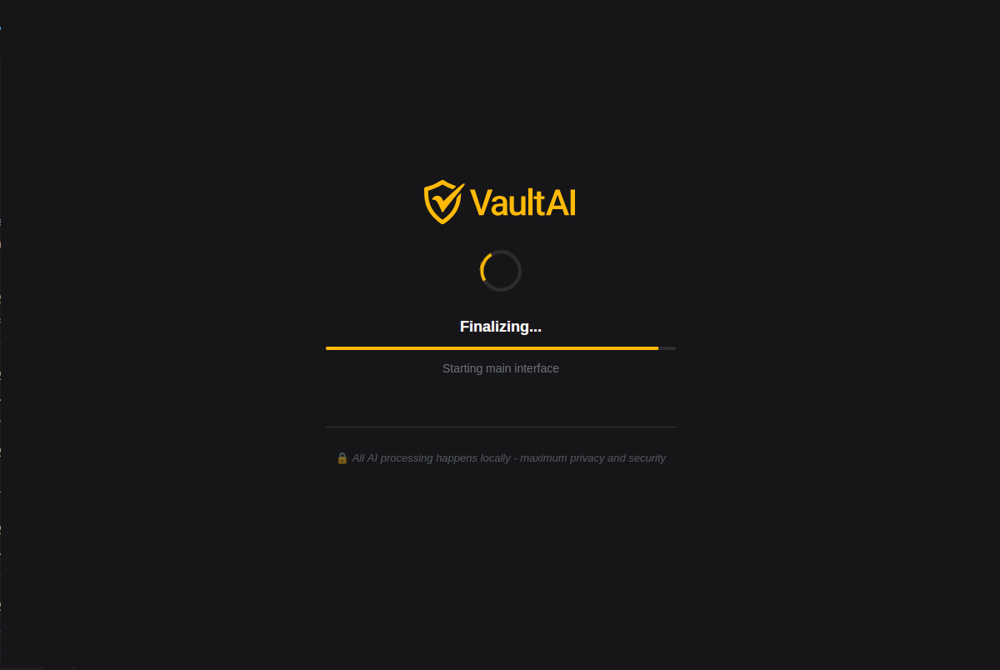
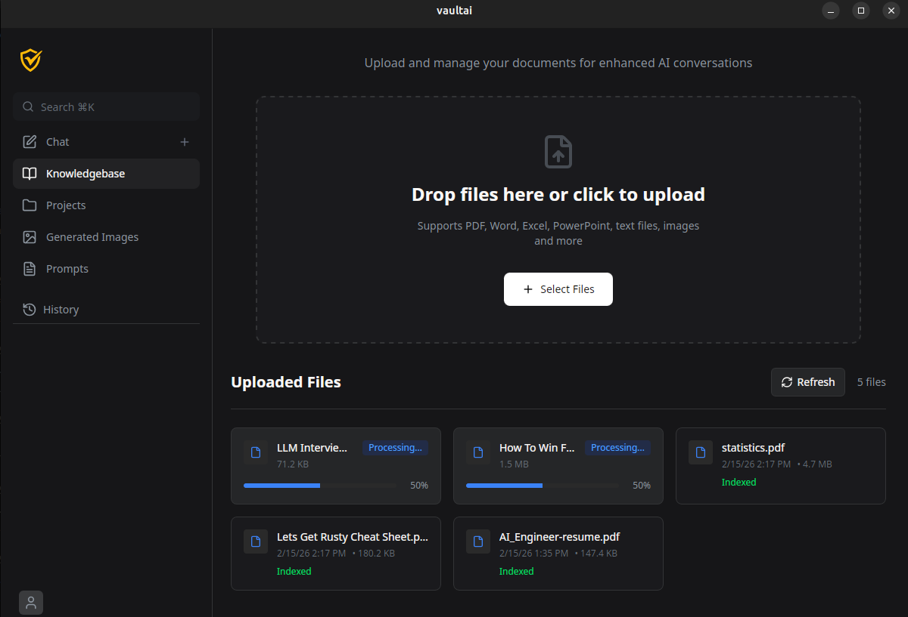
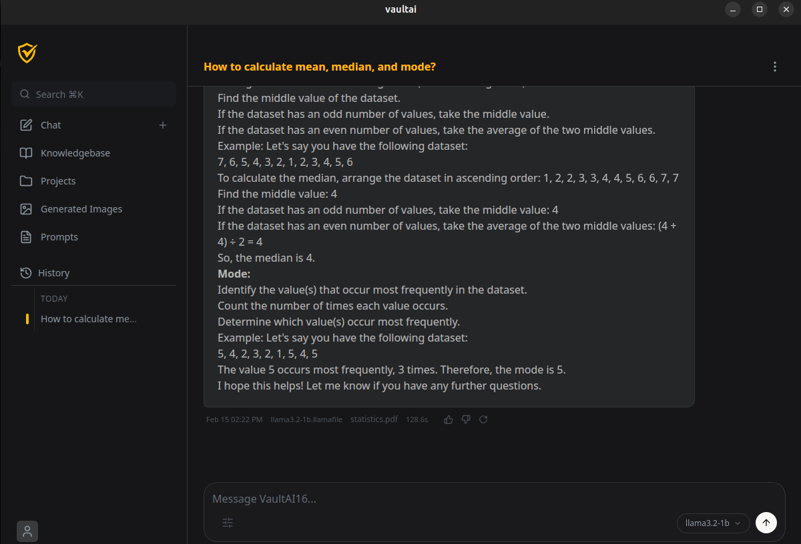
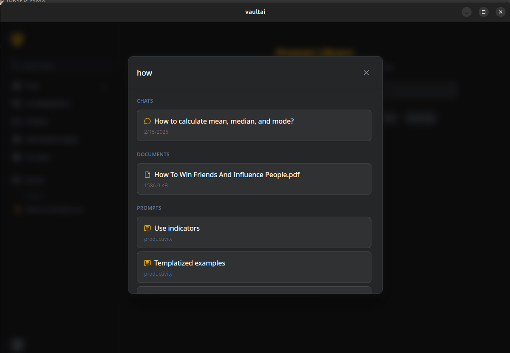

# VaultAI

VaultAI is a secure, personal AI workstation built with **Tauri v2**, **Rust**, and **React**. It is the ultimate self-contained AI device: enjoy uncensored, unlimited use with no token limits, zero AI watermarks, and 100% personalized responses, tell it anything, any way you want, and create whatever you need, privately. Everything runs locally, powered by state-of-the-art AI models, so your ideas and data never leave your pocket-sized, portable device, no clouds, no exposure, and no restrictions. With VaultAI, work and create freely and securely, off-grid, wherever you are, with full confidence that only you control what’s inside.

## 📸 Screenshots

<div align="center">
  
  
  
  
</div>

## 🚀 Tech Stack

### Frontend

- **Framework:** React 19 (TypeScript)
- **State Management:** Zustand (Store-based architecture)
- **Styling:** Tailwind CSS 4
- **Icons:** Lucide React
- **Build Tool:** Vite

### Backend

- **Core:** Rust (Tauri v2)
- **AI Inference:** llamafile (Local LLM execution)
- **Vector Search:** LanceDB (Embedded serverless vector database)
- **Database:** SQLite (via Tauri SQL Plugin)
- **File System:** Local-first encrypted storage (via Tauri FS Plugin)
- **Communication:** Secure IPC Bridge (Type-safe Commands)

---

## 🛠️ Architecture Overview

VaultAI follows a strict **Component -> Store -> Command** flow:

1.  **UI Components**: React views that consume data strictly from Zustand stores.
2.  **Stores**: Orchestrate logic and trigger Tauri commands.
3.  **Commands**: TypeScript wrappers for Rust functions that interact with the OS, Database, and AI.

---

## 🏃 How to Run

### 1. Prerequisites

Before starting, ensure you have the following installed:

- **Node.js & pnpm** (v18 or higher)
- **Rust & Cargo** (Latest stable version)
- **System Dependencies**:
  - **Linux**: `apt install libwebkit2gtk-4.1-dev build-essential curl wget file libxdo-dev libssl-dev libayatana-appindicator3-dev librsvg2-dev`
  - **macOS**: Xcode Command Line Tools (`xcode-select --install`)
  - **Windows**: [WebView2 Runtime](https://developer.microsoft.com/en-us/microsoft-edge/webview2/) and C++ Build Tools.

### 2. Setup

Clone the repository and install dependencies:

```
 git clone <your-repo-url>
 cd vaultai
 pnpm install
```

### 3. Download AI Models

Download models as llamafile from [Mozilla Hugging Face](https://huggingface.co/mozilla-ai) and store them in the `models/` directory:

### 4. Run in Development Mode

This starts the Vite dev server and the Tauri Rust window:

```
 pnpm tauri dev
```

---

## 📦 Building Executables

Tauri handles cross-compilation best when run on the native host OS. To create an executable for your current platform:

### Build Command

```
pnpm tauri build
```
### Output Formats by Platform

_Note: You must build on the respective platform to generate these._

#### 🐧 Linux

- **Format**: `.deb` (Debian/Ubuntu), `.AppImage`
- **Location**: `src-tauri/target/release/bundle/`

#### 🍎 macOS

- **Format**: `.app`, `.dmg`
- **Location**: `src-tauri/target/release/bundle/macos/`

#### 🪟 Windows

- **Format**: `.msi` (installer), `.exe`
- **Location**: `src-tauri/target/release/bundle/msi/`

---

## 📂 Project Structure

```text
vaultai/
├── src/                    # React Frontend (TypeScript)
│   ├── assets/             # Static assets (images, icons, fonts)
│   ├── components/         # UI Components
│   │   ├── common/         # Reusable UI elements (Dropdown, Inputs, etc.)
│   │   ├── layout/         # Core layout (Sidebar, MainContent)
│   │   ├── modals/         # Modal dialogs
│   │   └── ...             # Feature-specific containers (Chat, Files, etc.)
│   ├── data/               # Static configurations & premade prompts
│   ├── services/           # Backend communication bridge
│   │   └── tauri/          # Tauri IPC & system service wrappers
│   ├── stores/             # Zustand state management (App logic)
│   ├── types/              # Global TypeScript definitions
│   ├── App.tsx             # Main application entry component
│   └── main.tsx            # React DOM mounting point
├── src-tauri/              # Rust Backend (Tauri v2)
│   ├── src/                # Rust Source
│   │   ├── commands/       # Tauri command handlers (Rust side)
│   │   ├── rag/            # RAG (Retrieval-Augmented Generation) engine
│   │   ├── lib.rs          # Tauri application setup
│   │   └── main.rs         # Application entry point
│   ├── capabilities/       # Security & Permission manifests
│   ├── Cargo.toml          # Rust dependencies & metadata
│   └── tauri.conf.json     # Tauri framework configuration
├── public/                 # Static public assets & screenshots
├── models/                 # Local directory for AI models (llamafile)
├── index.html              # Frontend entry HTML
├── package.json            # Node.js dependencies & scripts
└── tsconfig.json           # TypeScript configuration
```
